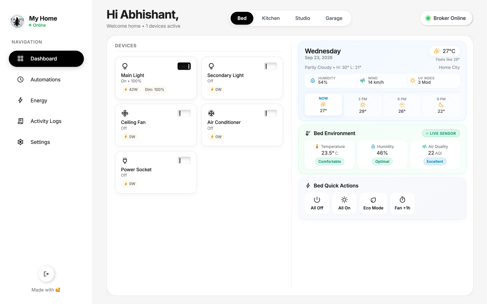
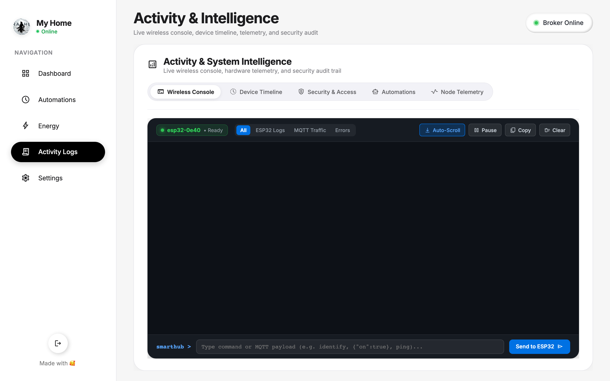
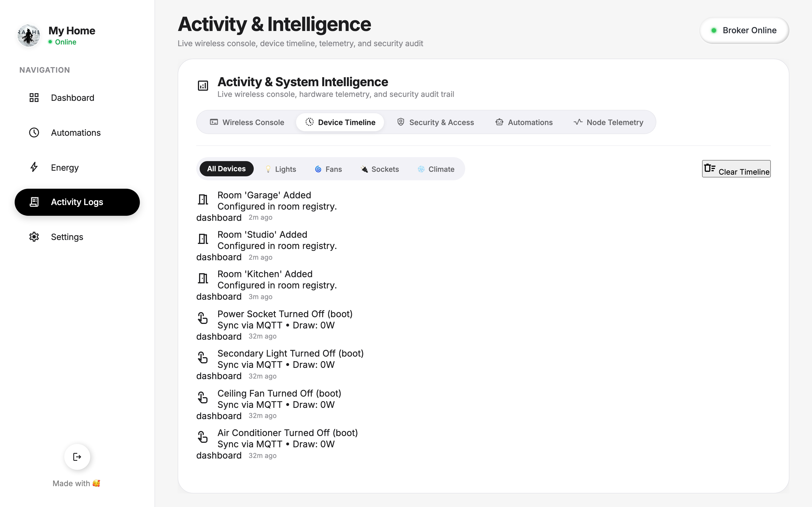
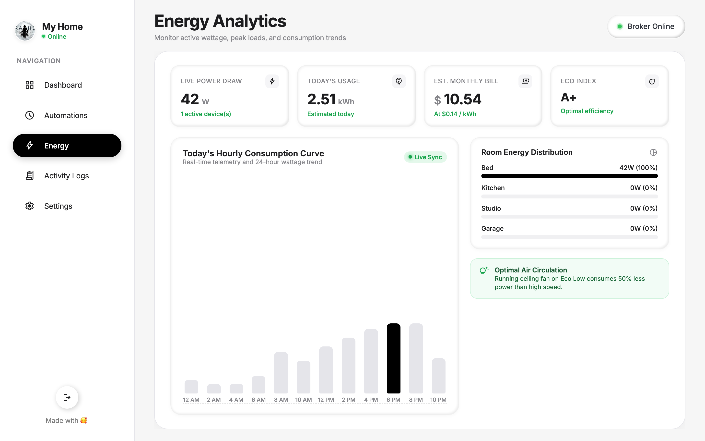
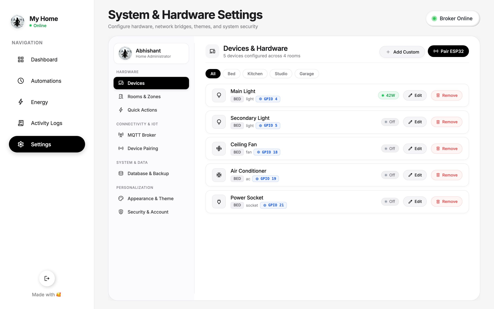
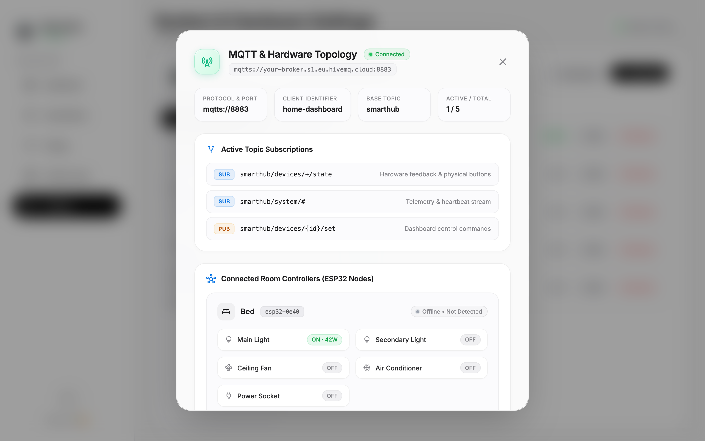

<div align="center">

# 🏡 SmartHub Universal Dashboard & IoT Architecture
### Next-Generation Smart Home Automation • Microsecond Bidirectional Sync • Universal ESP32 Firmware

[](https://nodejs.org)
[](https://expressjs.com)
[](https://mqtt.org)
[](https://espressif.com)
[](https://opensource.org/licenses/MIT)

<br/>

**SmartHub** is a self-hosted, ultra-responsive smart home control center and IoT architecture. Designed with a **modern Glassmorphism UI**, it delivers real-time bidirectional device control, live wireless terminal debugging, automated environmental monitoring, and comprehensive energy analytics over encrypted **TLS MQTT (port 8883)** and **Server-Sent Events (SSE)**.

[Explore Features](#-key-features) • [Visual Walkthrough](#-visual-walkthrough) • [Architecture](#%EF%B8%8F-system-architecture) • [Getting Started](#-getting-started) • [ESP32 Setup](#-esp32-firmware-setup) • [MQTT Protocol](#-mqtt-topic-architecture)

</div>

---

## 📸 Visual Walkthrough

### 1. Main Dashboard & Room Environment
The command center provides an instant overview of all paired rooms, active power draw, live 3-hourly weather forecasts, ambient temperature/humidity metrics, and quick action scenes.
- **Micro-Animated Device Tiles**: Real-time physical toggle switches with state indicators (On, Off, Standby).
- **PWM Voltage Dimming & Fan Speed**: Granular brightness and speed adjustments without screen flicker.
- **Smart Quick Actions**: Single-tap room automation scenes (*All Off, All On, Eco Mode, Fan +1h Timer*).

<div align="center">
  
</div>

<br/>

### 2. Activity & Intelligence Center
A unified diagnostics hub featuring a real-time wireless console and an immutable event timeline.

#### 📡 Live Wireless Console
Stream ESP32 serial logs, auto-discovery beacons, and MQTT message traffic over Wi-Fi directly into your browser—eliminating the need to connect micro-controllers via USB serial cables.
- **Filtering**: Instant categorical filters (`All`, `ESP32 Logs`, `MQTT Traffic`, `Errors`).
- **Stream Controls**: Real-time auto-scroll, stream pause, and copy-to-clipboard tools.
- **Direct Terminal Injection**: Transmit payloads (`{"on": true}`, `identify`, `ping`) straight to specific ESP32 nodes over MQTT.

<div align="center">
  
</div>

<br/>

#### ⏱️ Device & Appliance Activity Timeline
Visual audit trail logging every device interaction across your entire home. Shows exact trigger origins (*Physical Wall Switch, Web Dashboard, Automation Routine*), timestamps, and nominal power draw.

<div align="center">
  
</div>

<br/>

### 3. Energy Analytics & AI Eco Insights
Understand electricity consumption patterns and lower utility costs with dedicated power telemetry.
- **24-Hour Hourly Consumption Curve**: Peak load visualizer tracking kilowatt-hour (kWh) trends.
- **Room Energy Distribution**: Live wattage breakdown by room and individual appliance.
- **Dynamic Cost Estimator**: Calculates estimated monthly bills based on real-time usage and configurable tariff rates.
- **Eco Rating**: Automatic efficiency rating (A+ to F) with contextual energy-saving recommendations.

<div align="center">
  
</div>

<br/>

### 4. Master-Detail System & Hardware Settings
Complete control over your smart home configuration without touching raw configuration files.
- **Hardware Mapping**: Associate physical ESP32 GPIO pins directly with room devices.
- **Multi-Room Manager**: Create, rename, and assign icons to rooms.
- **Appearance Presets**: Switch seamlessly between Apple Pure Light, Warm Sunlight, and Midnight OLED themes.
- **Multi-User Directory**: Role-based access control (Admin, Family, Guest) with individual PIN code protection.

<div align="center">
  
</div>

<br/>

### 5. Live MQTT & Hardware Topology Diagnostics
Click the status pill at any time to open the diagnostics inspector. Inspect active topic subscriptions, TLS handshake status, and health states for all distributed ESP32 nodes.

<div align="center">
  
</div>

---

## 🌟 Key Features

| Capability | Feature Description |
| :--- | :--- |
| **⚡ Microsecond Dual Sync** | Physical wall switches and digital dashboard tiles synchronize instantaneously with built-in loopback suppression. |
| **📶 Zero-Code Wi-Fi Provisioning** | ESP32 launches a SoftAP Captive Portal (`SmartHub-Setup-XXXX`) on first boot for browser-based Wi-Fi configuration. |
| **💾 Non-Volatile Flash Persistence** | Device states, Wi-Fi credentials, and node identifiers persist in ESP32 Flash (`Preferences.h`) across power cuts. |
| **🔒 Enterprise Security** | TLS v1.3 encryption over MQTT port 8883, decoupled credentials, and PIN-code protected administrative functions. |
| **💡 PWM Dimming & Speed Control** | Native ESP32 LEDC hardware timer control for smooth light dimming (0–100%) and multi-speed ceiling fan regulators. |
| **📡 Auto-Discovery Protocol** | New ESP32 nodes broadcast an announce beacon upon booting, enabling one-click pairing from the dashboard. |
| **🌍 Environmental Intelligence** | Integrates local weather conditions, UV index, humidity, air quality (AQI), and indoor comfort feedback. |

---

## 🏗️ System Architecture

```text
 ┌────────────────────────────────────────────────────────────────────────┐
 │                    Web Dashboard (HTML5 / Vanilla CSS / ES6+)          │
 │  - Real-Time Tiles      - Quick Action Scenes    - Energy Analytics    │
 │  - Wireless Terminal    - Hardware Topology      - Multi-User Access   │
 └──────────────────────────────────┬─────────────────────────────────────┘
                                    │ SSE (Server-Sent Events) & REST APIs
 ┌──────────────────────────────────▼─────────────────────────────────────┐
 │                       Node.js / Express Gateway Server                 │
 │  - TLS MQTT Client (Port 8883)          - Live SSE Broadcast Engine    │
 │  - Hardware Registry (database.json)    - Granular State Cache         │
 │  - Energy Aggregator & Log Auditing     - MQTT Auto-Discovery Listener │
 └──────────────────────────────────┬─────────────────────────────────────┘
                                    │ Encrypted MQTT over TLS (v1.3)
 ┌──────────────────────────────────▼─────────────────────────────────────┐
 │                    Cloud / Local MQTT Broker (HiveMQ Cloud)            │
 │  - Port 8883 TLS Encrypted Data Bus                                    │
 └──────────────────────────────────┬─────────────────────────────────────┘
                                    │ Pub / Sub Bidirectional Channels
 ┌──────────────────────────────────▼─────────────────────────────────────┐
 │                     ESP32 Hardware Nodes (sketch.ino)                  │
 │  - Hardware Relay GPIOs                 - Debounced Wall Switch Inputs │
 │  - Hardware Timer PWM Dimming           - SoftAP Wi-Fi Captive Portal  │
 │  - Flash NVS Storage (Preferences.h)    - Status Indicator LED State   │
 └────────────────────────────────────────────────────────────────────────┘
```

---

## 🔌 Hardware Reference & Pinout

The included universal firmware ([`sketch.ino`](./sketch.ino)) supports relays, PWM dimmers, fan regulators, and physical wall switches out of the box:

| Component | Default GPIO Pin | Mode | Description |
| :--- | :--- | :--- | :--- |
| **Relay 1 (Main Light)** | `GPIO 4` | Output (PWM / Dig) | Supports on/off toggling and 8-bit hardware PWM dimming (5 kHz). |
| **Relay 2 (Secondary Light)** | `GPIO 5` | Output (Digital) | Digital relay control for auxiliary lighting. |
| **Relay 3 (Ceiling Fan)** | `GPIO 18` | Output (PWM / Dig) | Multi-speed fan control (Speeds 1 to 5). |
| **Relay 4 (Air Conditioner)** | `GPIO 19` | Output (Digital) | Climate relay control. |
| **Relay 5 (Power Socket)** | `GPIO 21` | Output (Digital) | High-load appliance socket relay. |
| **Physical Wall Switch 1** | `GPIO 32` | Input (Pull-up) | External toggle switch input with software debounce. |
| **Physical Wall Switch 2** | `GPIO 33` | Input (Pull-up) | External toggle switch input with software debounce. |
| **Status Indicator LED** | `GPIO 2` | Output | Visual feedback for Wi-Fi discovery, connecting, and broker sync. |

---

## 📡 MQTT Topic Architecture

The system communicates over a structured, standardized topic hierarchy:

| Topic Pattern | Direction | Purpose | Example Payload |
| :--- | :---: | :--- | :--- |
| `smarthub/devices/{id}/set` | Server → ESP32 | Command to change device state | `{"on": true, "brightness": 85}` |
| `smarthub/devices/{id}/state` | ESP32 → Server | State confirmation & physical switch feedback | `{"on": true, "brightness": 85, "source": "switch"}` |
| `smarthub/system/discovery` | ESP32 → Server | Boot announcement for auto-discovery | `{"nodeId": "esp32-0e40", "ip": "...", "mac": "..."}` |
| `smarthub/system/telemetry` | ESP32 → Server | Node health beacon (RSSI, Free Heap, Uptime) | `{"rssi": -58, "freeHeap": 218440, "uptime": 51720}` |
| `smarthub/system/command` | Server → ESP32 | Diagnostic commands (`ping`, `identify`, `restart`) | `{"command": "identify"}` |

---

## 🚀 Getting Started

### 1. Prerequisites
- **Node.js**: v18.0.0 or higher
- **npm**: v9.0.0 or higher
- **Arduino IDE**: 2.0+ with the ESP32 Board Package installed
- **Arduino Library**: `PubSubClient` by Nick O'Leary

### 2. Backend Setup
```bash
# Clone the repository
git clone https://github.com/Abhishantpadam/SmartHub-Dashboard.git
cd SmartHub-Dashboard

# Enter backend directory and install dependencies
cd Backend
npm install

# Initialize configuration files from templates
cp mqtt-config.example.json mqtt-config.json
cp database.example.json database.json

# Start the development server
npm run dev
```

Open your browser and navigate to **`http://localhost:3000`**.

---

## 🛠️ ESP32 Firmware Setup

1. In the project root, duplicate the example secrets header:
   ```bash
   cp secrets.h.example secrets.h
   ```
2. Open [`secrets.h`](./secrets.h.example) and configure your cloud broker credentials:
   ```cpp
   #define DEFAULT_MQTT_HOST       "your-broker.s1.eu.hivemq.cloud"
   #define DEFAULT_MQTT_PORT       8883
   #define DEFAULT_MQTT_USER       "your_username"
   #define DEFAULT_MQTT_PASSWORD   "your_password"
   ```
3. Open [`sketch.ino`](./sketch.ino) in the Arduino IDE.
4. Select your ESP32 board (e.g., *ESP32 Dev Module*) and target COM port.
5. Click **Upload** to flash the firmware.
6. **Wi-Fi Provisioning**:
   - On initial boot, the ESP32 broadcasts a Wi-Fi access point: `SmartHub-Setup-XXXX`.
   - Connect using your phone or laptop. The captive portal will appear automatically.
   - Select your home Wi-Fi SSID, enter your password, and save.
   - The ESP32 connects to Wi-Fi, establishes a TLS link with the broker, and automatically registers with the dashboard!

---

## 🔒 Security & Privacy

- **Decoupled Architecture**: All real Wi-Fi credentials (`secrets.h`), broker logins (`Backend/mqtt-config.json`), user PINs (`Backend/user-profile.json`), and paired node MACs (`Backend/database.json`) are strictly excluded via `.gitignore`.
- **Encrypted Transport**: Secure WebSocket / TLS v1.3 encryption on MQTT port 8883 prevents eavesdropping on your home automation traffic.
- **PIN-Protected Privileges**: Multi-user permissions safeguard sensitive device modifications and system settings.

---

## 📄 License

This project is licensed under the **MIT License** — feel free to use and modify it for personal and commercial IoT deployments.
